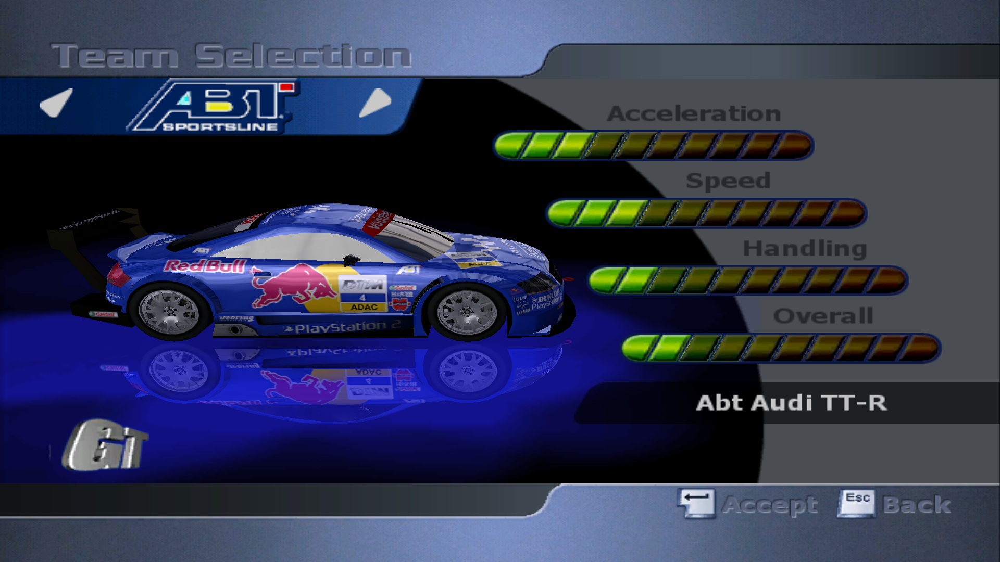
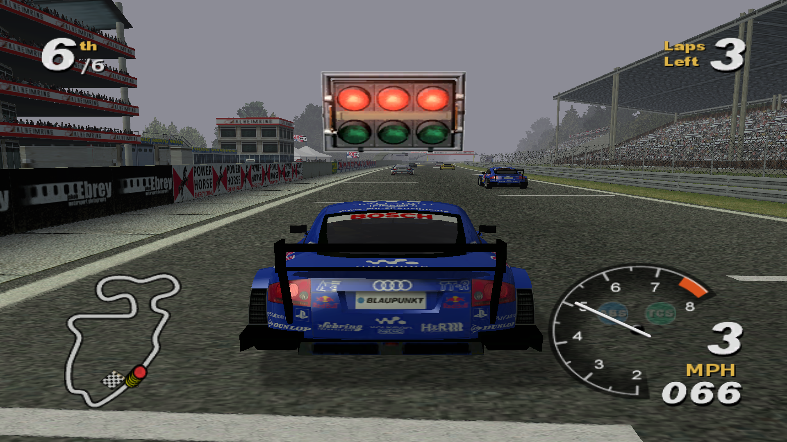
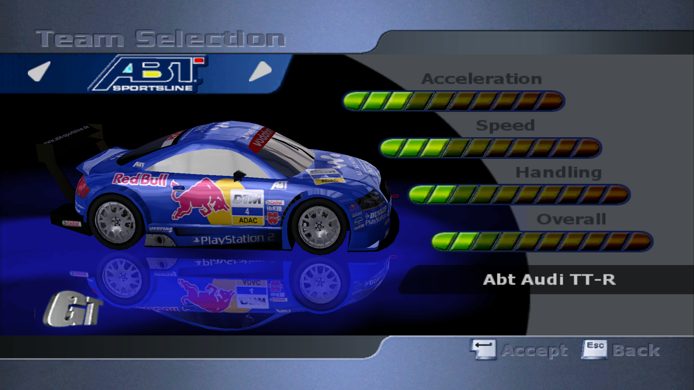
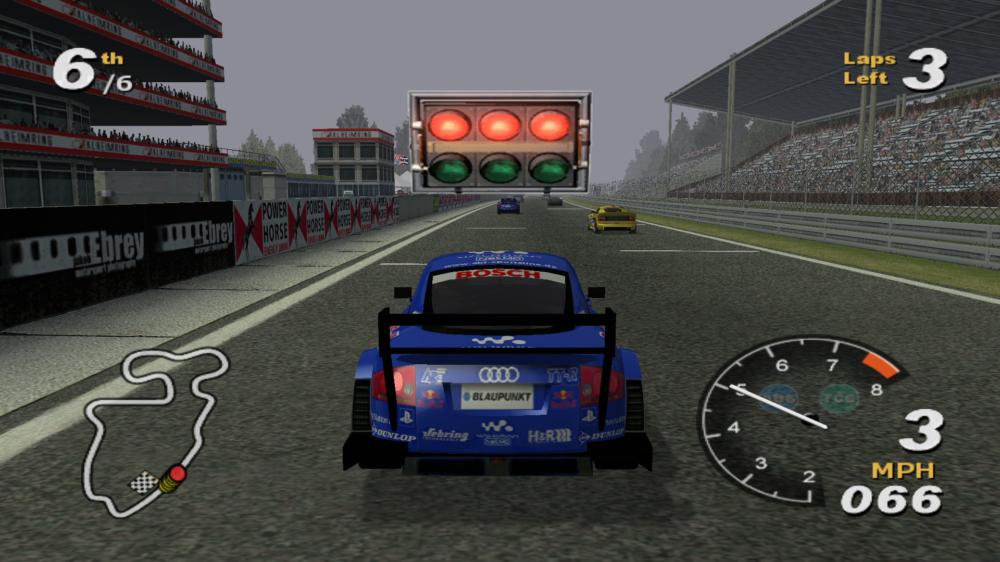

# Auto FOD Mod

This mod read height and width from game settings and calculate aspect ratio and FOD.

This mod is based on [WidescreenFixesPack](https://github.com/ThirteenAG/WidescreenFixesPack). I implemented [GetFOV2](https://github.com/ThirteenAG/WidescreenFixesPack/blob/9b23134ee794ede50c32b072b3ac40fc317e013b/includes/stdafx.cpp#L8) in ASM x86.

```c++
float GetFOV2(float f, float ar)
{
    return 4.0f * f * atan(ar * (3.0f / 4.0f)) / (float)M_PI;
}
```

Before:





After:



